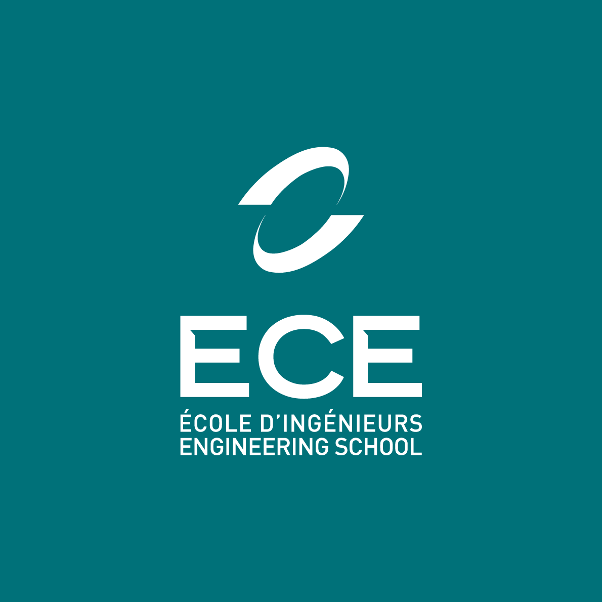

<!--
# Style lead only for this slide
_class: lead
-->



Projet d'informatique
Algorithmique et langage C

<br><br><br>

# Labyrinthe<br>🧭🗺

<br><br><br>

<sub>2022-2023</sub>

---

# Titre

Lorem ipsum dolor sit amet [ece](https://www.ece.fr), consectetur adipiscing elit, sed do eiusmod tempor incididunt ut labore et dolore magna aliqua. 

## Titre 2

- Liste 1
- Liste 2
- Liste 3

---

# Titre

Lorem ipsum dolor **sit amet**, consectetur *adipiscing* elit, sed do eiusmod tempor incididunt ut labore et dolore magna aliqua. 

## Titre 2

1. Liste 1
1. Liste 2
1. Liste 3

---

# Titre

```C
for(int i = 0; i < 5; i++) {
    printf("%d ", i);
}
```

> 0 1 2 3 4 