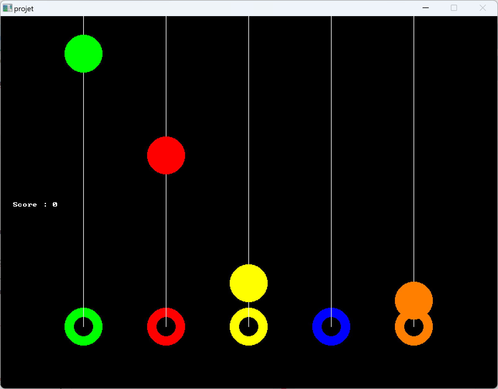

<!--
# Style lead only for this slide
_class: lead
_footer: Algorithmique Avancée et Bibliothèque Graphique - 2022-2023
-->

**ING1** Projet d'informatique

# ECE World, by Ponctuel

---

# Sommaire
- Thème et Carte
- Organisation des jeux
- Guitar Hero
- Snake
- Frogger
- Bilan
---

# Equipe Ponctuel

- DESCHAMPS Hugo
- TOLEDANO Clément
- BALAGUER Jules

---

# ECE World

## Thème

- Terminal windows, bugs graphiques
- 3 jeux très complets
- 2 joueurs
- 5 tickets par joueur
---

# Carte `1/2`

*Réalisée par : **Clément**, **Jules**, **Hugo**.*
Fonctionnalités :
- Choix du style graphique
- Déplacement sur la carte avec carte des collisions
- Affichage des scores des joueurs
- Affichage des tickets restants

---

# Carte `2/2`

:warning: Problèmes rencontrés :
-> Des crash inopinés, rendant l'implémentation difficile
-> Des bugs à la fin d'un jeu et la gestion des tickets associée

---

# Organisation des jeux

Les jeux ont tous été codés dans des fichiers source indépendants. L'arborescence est telle que :

%%{init: {'theme':'neutral'}}%%
flowchart LR
    Projet --> Assets --> Jeu
    Projet --> file.c
    Projet --> file.h

Les jeux ne prennent aucun paramètres et renvoie un entier qui correspond au score du joueur ou dans le cas de frogger quel joueur à gagné.

Pour lancer un jeu, il suffit de diriger son personnage vers l'une des icone de jeu presentes sur le terminal.

---

# GUITAR HERO

*Réalisé par : **Jules** (100%)*

- Il y'a 5 touches (A, Z, E, R, T) qui correspondent aux 5 cordes de la guitare.
- Les notes tombent du haut de l'écran vers le bas.
- Le joueur doit appuyer sur la touche correspondant à la note au bon moment.
- Si le joueur appuie sur la touche au bon moment, il gagne un point.
- Si le joueur appuie sur la touche au mauvais moment, il perd et donne la main au joueur suivant.

:bulb: Remplacez les images par des captures d'écran de votre jeu.

---

# GUITAR HERO

### Structures

- `struct t_touche`
    - `int posx`
    - `float posy`

---

### Fonctions

- `int choix_difficulte(BITMAP *image)`
- `int Guitar_hero(BITMAP *image)`
- `int guitar_hero()`

---

# GUITAR HERO

### Logigramme

---

# Snake à 2 joueurs

*Réalisé par : **Clément** (100%)*

- Le jeu se joue à un joueurs.
- Géré avec des listes chaînées
- Les 2 joueurs se voient lancer le jeu à la suite.
- Le but du jeu est de manger le plus de pommes possible tout en évitant de se mordre la queue, de se prendre un mur ou le corps du serpent adverse.

---

# Snake à 2 joueurs

---
# Structures

- `struct Queue`
    - `int posx, posy`
    - `int cadx, cady`
    - `struct Queue *suivant`

- `struct Tete`
    - `int posx, posy`
    - `int cadx, cady`
    - `int direct, futDirect`
    - `t_queue *suivant`
    - `int pomX, pomY`

---

# Fonctions

- `void viderQueue(t_queue* maillon)`
- `void viderSerpent(t_tete* tete)`
- `int mur(t_tete* tete)`
- `int queueIci(t_queue* maillon,int cadX, int cadY)`
- `void ajouterQueueQ(t_queue* maillon)`
- `void ajouterQueue(t_tete* serpent)`
- `void effacerQueue(t_queue *maillon)`
- `int supprimerQueue(t_queue * maillon)`
- `void effacerSerpent(t_tete *tete)`
- `void afficherQueue(t_queue *maillon,int cadX,int cadY)`
- `void afficherSerpent(t_tete *tete)`
- `void pasQueue(t_queue *maillon, int futCadx, int futCady)`
- `void actCaseQueue(t_queue *maillon, int X, int Y)`
- `void pasSerpent(t_tete *tete)`
- `void caseSerpent(t_tete *tete)`
- `int snake()`

---

# FROGGER

*Réalisé par : **Hugo** (100%)*

- Il y'a 5 touches par joueur (Z, Q, S, D, C)(I, J, K, L, N) qui correspondent aux 4 direction vers laquelle peut aller la grenouille ainsi qu'un bouton de saut.
- Les buches bougent de la gauche de l'écran vers la droite et de la droite de l'écran vers la gauche.
- Le joueur doit se déplacer au bon moment pour pouvoir monter sur les buches et redescendre sur terre.
- Si le joueur atteint la ligne d'arrivée, il gagne le jeu et le jeu se ferme.
- Si le joueur est emporté par une buche vers les côtés de l'écran, il perd et le jeu se ferme si les deux grenouilles disparaissent.

:bulb: Remplacez les images par des captures d'écran de votre jeu.

---

# FROGGER

### Structures

- `struct Log`
  - `int x`
  - `int y`
  - `int speed`
  - `BITMAP *sprite`
  - `BITMAP *collisions`

- `struct Log`
  - `int x`
  - `int y`
  - `int alive`
  - `BITMAP *sprite`

---

### Fonctions

- `void bitmapLoader();`
- `void freeBitmap();`
- `Log* createLog(int x, int y, int speed, BITMAP *sprite, BITMAP *colisions);`
- `void drawLog(Log *log);`
- `void moveLog(Log *log, int speed);`
- `Frog* createFrog(int x, int y, BITMAP *sprite);`
- `void drawFrog(Frog *frog);`
- `void moveFrog(Frog *frog);`
- `int calculCollisions(int x, int y, BITMAP *colisions);`
- `int calculVide(int x, int y, BITMAP *colisions);`
- `int conditionVictoire(Frog *frog);`
- `int checkVictoire(Frog *frog1, Frog *frog2);`

---

<!--
_class: lead
-->

# Les slides suivantes ne seront pas présentées oralement lors de la soutenance mais doivent figurer dans la présentation. Nous les survolerons rapidement.

---

# BILAN

## Tâches réalisées (pour chaque membre de l'équipe)

- `✅ 100%` Créer une carte, 2 joueurs et un classement 
    - *Pour certains jeux, les regles et les scores ne sont pas affichés mais c'est en route.*
- `✅ 100%` Terminer les 3 jeux (jeu.c)
    - *Tous les jeux sont terminés.*
- `✅ 100%` Relier la carte aux jeux (main.c)
    - *Les jeux sont reliés à la carte et s'exécutent normalement.*

---

# Bilan individuel

Hugo : Projet très intéressant / Bonne cohésion d'équipe / Bonne gestion du temps

Clément : Super projet / Bonne cohésion d'équipe / Bonne gestion du temps

Jules : Beaucoup de plaisir à travailler sur ce projet / Bonne cohésion d'équipe / Bonne gestion du temps

---

# Investissement

Si vous deviez vous répartir des points, comment feriez-vous ?

%%{init: {'theme':'neutral'}}%%
pie showData
    "Hugo" : 33
    "Clément" : 33
    "Jules" : 33

---

# Récapitulatif des jeux

| Jeu | Avancement | Problèmes / reste |  
|  | --- | --- |
| Frogger | 100% | - |
| Guitar Hero | 100% | - |
| Snake | 100% | - |

<!--
_class: lead
-->

---

# Schémas et Graphes

Comits et activités des membres de l'équipe

---

# Comparaison entre l'ajout des éléments et leurs retraits

---

## Comparaison entre les commits et les ajouts de lignes de code dans une periode hebdomadaire

---
# Merci de nous avoir écoutés !

